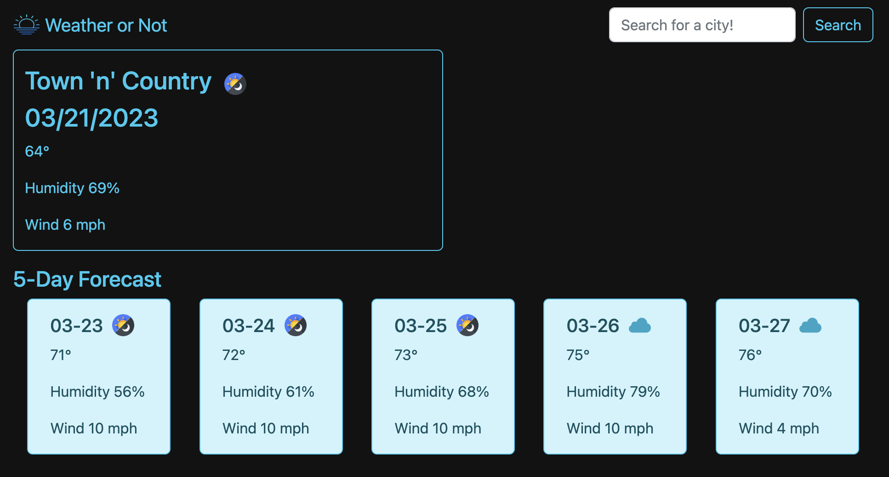
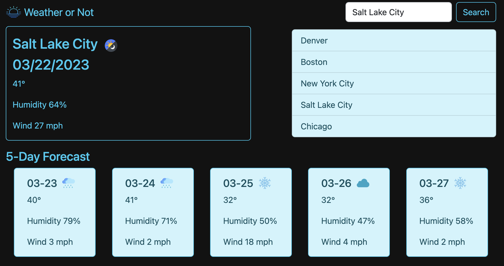

# Weather or Not

## Description

This weather app displays current local weather and a 5-day forecast of the current location.  Search for a city, and the app will populate data regarding current weather for that city and a 5-day forecast for that city.  The app displays the user's most recent 5 searches, so they can click on one to view weather data for that city again.

## Installation

N/A

## Usage

Once the page loads, the user is presented with local weather data.

Then the user can type into the "Search for a city!" field and click "Search" in order to search for a city's weather.  The last 5 searches will also remain on the page so that the user can click on a previously-searched city to re-populate that weather data.

## Credits
- https://www.flaticon.com/free-icons/sunrise
- https://m2.material.io/design/color/dark-theme.html
- https://www.w3schools.com/howto/howto_css_fixed_footer.asp
- tutoring 20MAR2023
- https://developer.mozilla.org/en-US/docs/Web/JavaScript/Reference/Global_Objects/Array/shift
- https://www.toptal.com/designers/htmlarrows/math/degree-sign/
- https://www.compart.com/en/unicode/U+0025
- "https://www.flaticon.com/free-icons/night"
- https://www.flaticon.com/free-icons/cloud-computing
- https://www.flaticon.com/free-icons/fog
- https://www.w3schools.com/jsref/jsref_split.asp
- tutor 21MAR2023
- https://www.flaticon.com/free-icons/rain
- https://www.flaticon.com/free-icons/storm
- https://www.flaticon.com/free-icons/snowflake
- https://stackoverflow.com/questions/3087975/how-to-change-the-cursor-into-a-hand-when-a-user-hovers-over-a-list-item

## License

MIT License

## Deployed Application Link

Paste your deployed application link here.